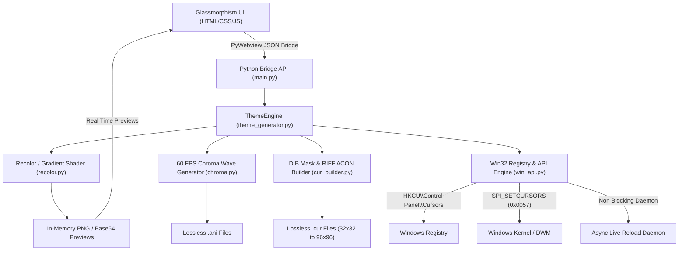

# Cursor Concept: System Architecture & Internals

This document provides a deep technical overview of **Cursor Concept**, its graphics rendering pipeline, Win32 kernel interactions, and high DPI scaling mechanics.

---

## 1. High Level System Architecture



---

## 2. Windows Cursor Subsystem & Win32 APIs

### 2.1 The 17 Slot System Registry Schema
Windows cursor schemes are persisted in the user registry under:
```
HKEY_CURRENT_USER\Control Panel\Cursors
HKEY_CURRENT_USER\Control Panel\Cursors\Schemes
```
The Windows operating system kernel (`win32k.sys`) exposes exactly **17 global system roles**:
`Arrow`, `Help`, `AppStarting`, `Wait`, `Crosshair`, `IBeam`, `NWPen`, `No`, `SizeNS`, `SizeWE`, `SizeNWSE`, `SizeNESW`, `SizeAll`, `UpArrow`, `Hand`, `Pin`, and `Person`.

### 2.2 Live Reload without System Reboot (`SPI_SETCURSORS`)
Historically, changing Windows registry entries required logging out or restarting Explorer. Cursor Concept achieves instantaneous live reload using:
```python
ctypes.windll.user32.SystemParametersInfoW(
    0x0057,  # SPI_SETCURSORS constant
    0,
    None,
    0x01 | 0x02  # SPIF_UPDATEINIFILE | SPIF_SENDCHANGE
)
```
This triggers an OS wide parameter broadcast (`WM_SETTINGCHANGE`), instructing the Desktop Window Manager (DWM) and all top level windows to immediately reload their cursor cache.


### 2.3 Non Blocking Asynchronous Live Reload
Invoking `rundll32.exe user32.dll,UpdatePerUserSystemParameters` and memory swapping synchronously can block the application's UI thread for up to 1.5 seconds. Cursor Concept decouples this broadcast into an asynchronous background daemon thread:
```python
def _async_post_apply():
    try:
        live_swap_cursors_in_memory(cursor_files)
        subprocess.Popen(["rundll32.exe", "user32.dll,UpdatePerUserSystemParameters"])
    except Exception:
        pass

t = threading.Thread(target=_async_post_apply, daemon=True)
t.start()
```
This guarantees the user interface returns in **<5 milliseconds** with zero stutter.

---

## 3. Binary Format Engineering

### 3.1 32 bit RGBA `.cur` Files with 1 bit AND Masks
Windows `.cur` files are based on the Windows Icon format (`ICO`), with two critical differences:
1. The 16 bit Type field in the header is `2` (Cursor) instead of `1` (Icon).
2. The image directory structure replaces color planes with `HotspotX` and `HotspotY` (uint16 little endian).
3. The image bitmap data is packed as a standard Windows Device Independent Bitmap (`BITMAPINFOHEADER`), followed by 32 bit BGRA pixel data, and concluded with a 1 bit monochrome **AND mask** calculated row by row to ensure backward compatibility with older GDI graphics drivers.


### 3.2 RIFF `ACON` Animated Cursor Format (`.ani`)
Windows animated cursors use the Resource Interchange File Format (RIFF). The binary structure comprises:
- **`RIFF` header** with `ACON` fourCC.
- **`anih` chunk (36 bytes)**: Specifies frame count, step count, width, height, color depth, and frame rate (`jifRate`).
- **`rate` chunk**: Per frame duration table in Windows jiffies ($1\text{ jiffy} = \frac{1}{60}\text{ second} \approx 16.67\text{ ms}$).
- **`fram` list chunk**: Encapsulates $N$ independent `icon` chunks, each containing a complete 32 bit cursor frame.

---

## 4. High Refresh Rate Synchronization (165Hz Hardware DWM)

A common concern with animated cursors is whether running an animation at 60 FPS introduces stutter on high refresh monitors (144Hz, 165Hz, 240Hz, 360Hz).

### How Windows Separates Motion from Animation:
- **Cursor Position Tracking**: Managed directly by the GPU hardware cursor plane and Windows DWM at your monitor's native refresh rate (e.g., 165Hz). When you move the mouse across the screen, it samples at your full hardware polling rate.
- **Color Cycling / Frame Ticking**: Managed by the `.ani` frame timer at 60 FPS (`jifRate = 1`).
- **Result**: Color transitions cycle smoothly at 60 FPS without impeding the fluid 165Hz hardware cursor movement.

---

## 5. The Windows 17 Slot OS Limit vs Chromium/Electron Architecture

### Why Modern Web Cursors (`col-resize`) Require Special Handling
1. In standard desktop software, `col-resize` (horizontal panel splitters) and `row-resize` (vertical panel splitters) are W3C CSS cursor states.
2. Because Windows has no native registry slot for `col-resize`, Chromium and Electron applications (including Antigravity and VS Code) fall back to an internal hardcoded bitmap (`resources.pak`).
3. To override this in Electron apps without risky DLL injection, Cursor Concept provides direct CSS override snippets that tell Chromium to load the custom `.cur` file directly via CSS hardware acceleration.
