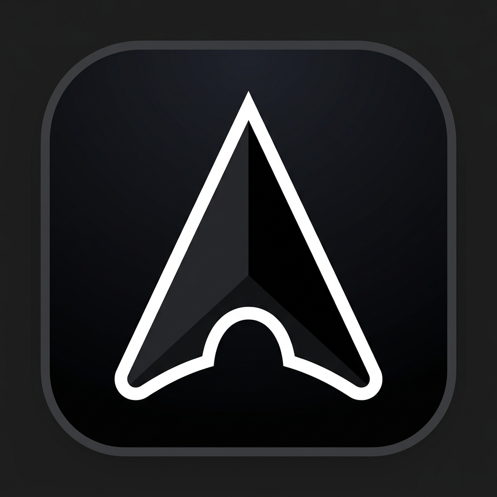

# Cursor Concept: Ultra HDPI Desktop Pointer Studio

<div align="center">
  
  <br/><br/>
  <strong>Next Generation Windows Mouse Cursor Customization Suite & Real Time Engine</strong>
  <br/><br/>

  <a href="https://github.com"></a>
  <a href="https://github.com"></a>
  <a href="Docs/SPECIFICATIONS.md"></a>
  <a href="LICENSE"></a>
  <a href="Docs/ARCHITECTURE.md"></a>
</div>

---

## Overview

**Cursor Concept** is a modern, standalone desktop pointer studio built for Windows 10 and 11. It provides an Obsidian Glassmorphism interface for tailoring, shading, animating, and instantly activating custom mouse cursor suites without system restarts.

Unlike legacy cursor customizers from the early 2000s, **Cursor Concept** is engineered for modern high DPI displays (125%, 150%, 200%), high refresh monitors (144Hz to 360Hz), and covers the full catalog of **all 34 Windows and W3C cursor transformations**.

---

## Key Features

### 1. Precision Shading & Color Control
- **Solid Fill**: Direct hex selection, screen pipette eyedropper, and quick access presets.
- **Floating Color Popover Overlay**: Compact swatch buttons trigger an anchored floating color picker featuring a 2D saturation/lightness canvas, 360° rainbow hue bar, hex input, and quick swatches, dismissing cleanly on outside click without consuming sidebar space.
- **2D Linear Gradient Shaders**: Smooth spatial interpolation between two color stops at any angle (0° to 360°) with live gradient strip feedback.
- **RGB Wave Dynamics**: Continuous rainbow spectrum cycling with adjustable speed (1x to 4x, 15 FPS to 60 FPS) and direction (Clockwise vs. Counter Clockwise) packaged as native Windows `.ani` pointers while cursor position tracking stays locked to your monitor's native 165Hz refresh rate.
- **Antialiased Outline Borders**: Choose between classic crisp White (Moga Dark), deep Black, or custom hex border.

### 2. Complete 34 Cursor Transformation Catalog
Full coverage of authentic W3C and Windows mouse states:
- **Pointers (7)**: Normal Select, Help Select, Alternate Select, Link Select, Location Select, Person Select, Context Menu.
- **Splitters (2)**: Column Split Capacitor (`col-resize` double bar with outward arrows) & Row Split Capacitor (`row-resize`).
- **Movement (3)**: Move 4 Way Arrow (`SizeAll`), Grab Open Hand (`grab`), Grabbing Closed Fist (`grabbing`).
- **Text (3)**: IBeam Text Select, Vertical Text, Handwriting Pen.
- **Resizers (6)**: Vertical (`SizeNS`), Horizontal (`SizeWE`), Diagonal 1 (`SizeNWSE`), Diagonal 2 (`SizeNESW`), North, South, East, West.
- **Actions (6)**: Precision Crosshair, Cell Select, Zoom In (+), Zoom Out (-), Drag Copy (+), Drag Alias, Drag No Drop, Eyedropper Pipette.
- **Feedback (3)**: Busy Spinner (`.ani`), Working in Background (`.ani`), Unavailable Stop Sign.

### 3. Live Interactive Sandbox Pad
- **Multi State Testing**: Move your cursor across interactive test cards (Normal, Link Hover, Text Select, Column Splitter, Row Splitter, 4 Way Move, Grab Hand, Busy Feedback) to experience transformations in real time.
- **Contrast Background Switcher**: Toggle between **Dark Grid**, **Light Mode** (verifies cursor visibility against Word, Google Docs, and light websites), and **Mesh Wallpaper Gradient**.
- **High DPI Scale Selector**: Dynamically preview your cursors at **1.0x (32px)**, **1.25x (40px)**, **1.5x (48px)**, and **2.0x (64px)**.

### 4. Full App Theming (System / Dark / Light)
- **Auto (System Default)**: Tracks Windows OS Dark/Light preference dynamically via `matchMedia`.
- **Dark Theme**: Signature Obsidian Glassmorphism with ambient radial violet glow.
- **Light Theme**: Crisp White & Slate glass with high contrast typography and subtle frosted shadows.
- Exclusively styled using clean geometric SVG icons (monitor, moon, sun) with zero AI sparkle motifs.

---

## Quick Start

1. **Launch**: Double click `Cursor Concept.exe` in the root folder.
2. **Customize**: Choose a curated preset (e.g. *Moga Purple*, *Cyber Neon*, *Sunset Vapor*) or design your own using the **Color Picker**, **Gradient Angle**, and **Outline Border**.
3. **Test**: Move across the **Live Interactive Sandbox** to verify hover states across Dark, Light, and Wallpaper backgrounds.
4. **Activate**:
    - Click **Apply to Windows**: Themes are live reloaded instantly across your desktop in <5ms without rebooting.
    - Click **Revert Default**: Restores standard Windows Aero pointers with 1 click.
    - Click **Export Pack**: Generates a standalone folder with all 34 `.cur` / `.ani` files and an automatic `Install.inf` setup script.

---

## Project Architecture

Organized cleanly matching modern desktop software layout conventions:

```
Cursor/
├── Cursor Concept.exe              # Main Standalone Application (Root entry)
├── .gitignore                      # Git ignore rules for clean repository
├── LICENSE                         # MIT Open Source License
├── README.md                       # Project overview & documentation
├── CONTRIBUTING.md                 # Contribution guidelines
├── SECURITY.md                     # Win32 security & zero hook safety policy
├── CHANGELOG.md                    # Release history
│
├── Data/                           # Core Application Data & Runtimes
│   ├── assets/                     # Application Icons & Base Templates (Moga Dark)
│   │   ├── Moga-Dark/              # Base cursor template assets
│   │   └── app_icon.ico            # Multi resolution PE executable icon
│   ├── ui/                         # Obsidian & Light Glassmorphism Webview Frontend
│   ├── engine/                     # Python Win32 & Vector Graphics Core
│   ├── Cursor Concept.spec         # PyInstaller build specification
│   └── main.py                     # Source runner for development

│
├── Tools/                          # Maintenance & Reset Utilities
│   └── Reset.cmd                   # Clean script to purge legacy Windows cursor folders
│
└── Docs/                           # In Depth Engineering Documentation
    ├── ARCHITECTURE.md             # Win32 kernel, DWM, RIFF ACON, and async pipeline
    └── SPECIFICATIONS.md           # 34 cursor catalog, hotspot matrix & shader math
```

---

## Maintenance Tools (`Tools/Reset.cmd`)

### What does `Tools/Reset.cmd` do?
When installing multiple third party cursor packs over time via Windows `.inf` right click installers, Windows copies those files into `C:\Windows\Cursors\`. Over time, leftover folders and outdated test suites can accumulate in that system directory.

**`Tools/Reset.cmd`**:
- Self elevates with Administrator privileges.
- Safely purges obsolete test folders from `C:\Windows\Cursors\`.
- Keeps your system cursor directory clean, organized, and lightweight.

---

## Technical Note: The Windows 17 Slot OS Limit & Electron Sashes

### Why Windows Schemes Don't Theme the Sidebar Sash in VS Code / Antigravity
- **Windows OS Schema**: Windows cursor schemes (`HKCU\Control Panel\Cursors`) were standardized in 1995 and define only **17 global system slots**. Windows OS has no registry key for `col-resize` or `row-resize`.
- **Chromium / Electron Handling**: When an Electron app (like Antigravity or VS Code) requests CSS `cursor: col-resize`, Chromium detects that Windows has no OS level slot for it and falls back to rendering an internal hardcoded bitmap (the white capacitor icon).
- **The Solution**: Your custom cursor is **100% active everywhere else across Windows**. If you want Antigravity or VS Code to use your custom splitter too, inject this simple 2 line CSS rule pointing to your exported theme suite:

```css
/* Point Antigravity sashes directly to your exported custom cursor files */
.monaco-sash.vertical,
.monaco-split-view2 > .monaco-scrollable-element > .monaco-sash.vertical {
    cursor: url("path/to/exported/Column Resize.cur"), col-resize !important;
}

.monaco-sash.horizontal {
    cursor: url("path/to/exported/Row Resize.cur"), row-resize !important;
}
```

---

## Documentation Index

- **[System Architecture](Docs/ARCHITECTURE.md)**: Deep dive into the Win32 subsystem, DWM 165Hz sync, RIFF `ACON` structure, and non blocking asynchronous live reload.
- **[Full Specifications](Docs/SPECIFICATIONS.md)**: Complete transformation catalog, hotspot coordinate matrix, and mathematical shader equations.
- **[Contributing Guide](CONTRIBUTING.md)**: Guidelines for contributing custom themes, reporting bugs, and PR workflow.
- **[Security Policy](SECURITY.md)**: Details our zero hook policy, safe registry management, and vulnerability disclosure.

---

## Credits & Acknowledgements

- **Original Cursor Concept & Vector Art**: Deep appreciation and full credit go to **jepriCreations** ([jepricreations.com](https://jepricreations.com/) and [DeviantArt: jepriCreations](https://www.deviantart.com/jepricreations)) for the original aesthetic vision and vector cursor designs behind the iconic *Windows 11 Cursor Concept* series.
- **Desktop Pointer Studio & Engine**: Developed as an open source homage and customization studio to give users real time RGB dynamics, 2D linear gradient shaders, multi scale Ultra HDPI rendering, and instant Win32 live activation.

---

## License

Distributed under the **MIT License**. See [`LICENSE`](LICENSE) for details.
